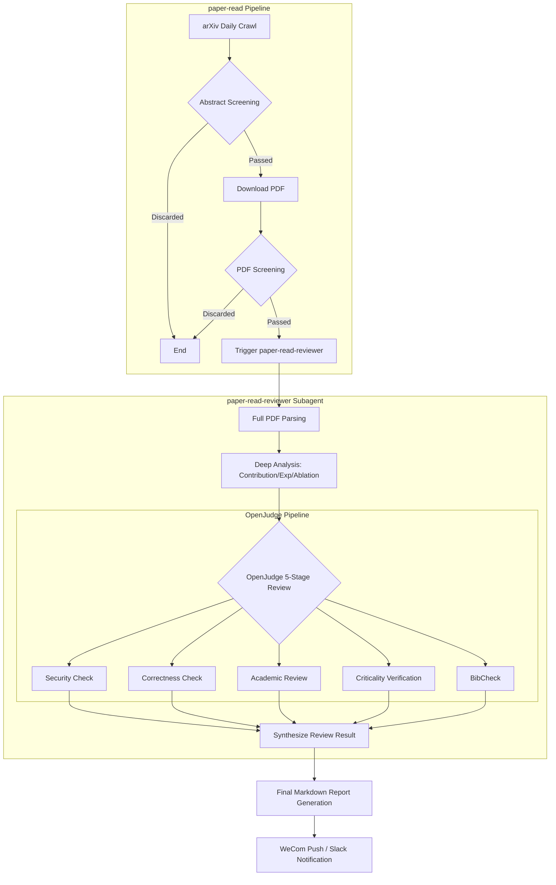

# arxiv-paper-read

A toolset for automatically reading and reviewing arXiv papers, specifically focusing on the `cs.CV` category.

## Workflow

## Components

### 1. [paper-read](./paper-read)
An automated pipeline that:
- Crawls the daily new papers from arXiv.
- Performs a two-stage screening process (Abstract-level followed by PDF-level).
- Uses the `paper-read-reviewer` subagent for in-depth analysis.
- Generates a comprehensive Markdown report.

### 2. [paper-read-reviewer](./paper-read-reviewer)
A specialized subagent skill for:
- Reading full PDF papers.
- Performing deep analysis (contributions, experiments, ablations).
- Executing the **OpenJudge 5-stage review** pipeline (Security, Correctness, Academic Review, Criticality Verification, BibCheck).
- Generating structured analysis results.

## Usage
Refer to the `SKILL.md` files in each directory for detailed instructions.
